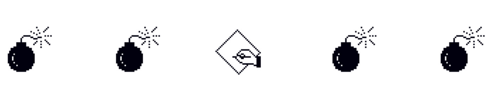

# source{d} Design

All things (open!) design at source{d}: branding, guidelines, UI assets, media & co.

## source{d} Brand Style Guide

Here you find the primary guidelines that ground our brand assets usage and overall branding rules. 

- [source{d} Brand Style Guide](https://docs.google.com/presentation/d/1q290ZrAMola1nSwzYmScOo3gsMgEIXKi2BsWgnMY078/edit?usp=sharing)

## source{d} UI Pattern Library

Here you find the UI Pattern Library for web brand applications.

- [source{d} UI Pattern library](ui-pattern-library/README.md)

## source{d} Presentation Template

Here you find the Presentation Template, that has by default the Get Started Guide Slides. 

- [source{d} Presentation Template 2019](https://docs.google.com/presentation/?ftv=1&tgif=d)

## Assets

### Guidelines

  
Click to see guideline details

#### Brand Assets should have

- Its own Project directory (lowercase)
- A README.md (project's context and relevant links)
- Asset's Original Illustrator file (.ai when applicable, lowercase, file size)
- Asset's Original Photoshop file (.psd when applicable, lowercase, file size)
- Screenshot of GitHub README.md Brand Header (.png image high-res)
- GitHub README.md Brand Header Illustrator File (.ai when applicable, lowercase, file size)
- GitHub README.md Brand Header Photoshop File (.psd when applicable, lowercase, file size)

#### Asset's Swag should have

- Ready to print Asset (desired/required file format, file size)
- Screenshot of Asset's Application Composition (.png image high-res)
- Original Photoshop/Illustrator Application Composition File (project-asset, lowercase, file size)
- Printer Guidelines Reference (when applicable)

### Artworks

- [source{d} Media Kit](media-kit/README.md)
- [go-git](go-git/README.md)
- [meetups](meetups/README.md)
- [awesome MLonCode](awesome-mloncode/README.md)
- [gitbase](gitbase/README.md)
- [Public Git Archive](pga/README.md)

### Extra Swag

- [source{d}-like Visual Studio Code color theme](https://github.com/kuba--/vscode/tree/master/extensions/monokai-sourced) (kudos to [@kuba--](@kuba--))

## License

[Creative Commons Attribution Share Alike 4.0 International](LICENSE)
