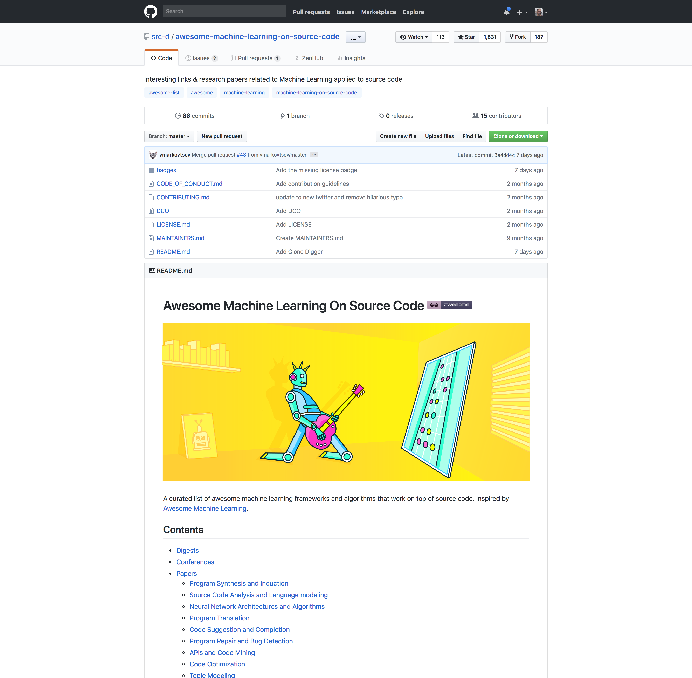

# Awesome MLonCode Artwork

### Awesome Machine Learning on Source Code

Interesting links & research papers related to Machine Learning applied to source code (MLonCode).

- [Awesome MLonCode](https://github.com/src-d/awesome-machine-learning-on-source-code)

---

#### Awesome MLonCode Art

- [Final Asset](files/awesome-machine-learning-artwork.png) 262 KB
- [Original Illustrator File](files/awesome-machine-learning-artwork.ai) 1,3 MB

#### Composition

