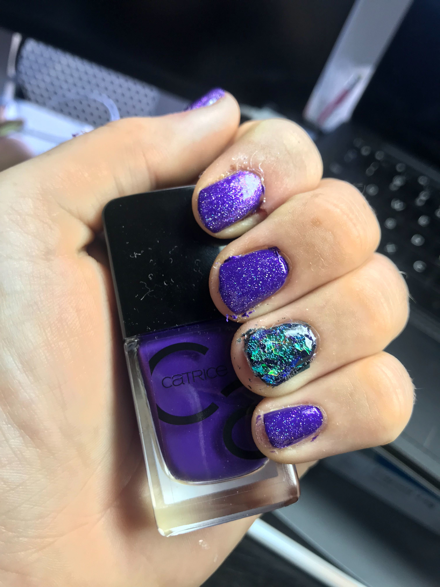

# source{d} Nail Polish

While there is no official source{d} nail polish you can create brand style guide compatible nails using the following polishes:
* [Catrice ICONails Gel Lacquer "69 If Not Purple... Then What?"](https://catrice.eu/en/nails/nail-polish/nail-products/catrice-cosmetics/iconails-gel-lacquer-69.html)
* Optional glitter top coat: [Catrice Shake & Seal Top Coat "02 Deep Blue Sea"](https://catrice.eu/en/nails/top-coat/nail-varnish/catrice-cosmetics/shake-seal-top-coat-1.html)

Currently this only covers the source{d} Brand Royal color, other color pallet suggestions are very welcome!

## Examples

