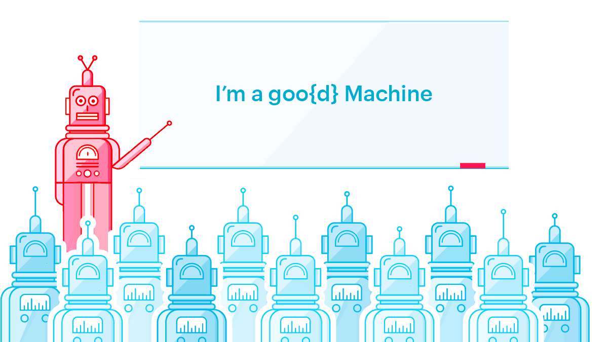

# Meetups Artwork

### Machine Learning on Source Code (San Francisco & Madrid)

Join us on regular discussions about Source Code analysis, Machine Learning, and the incredibly exciting field at their intersection.

[Machine Learning on Source Code - San Francisco](https://www.meetup.com/MLoSC-SF/)
[Machine Learning on Source Code - Madrid](https://www.meetup.com/MLoSC-Madrid/)

---

#### Meetup Art

[Final Asset](machine-learning-on-source-code/files/ML-SC-Meetup-Banner.png) 121 KB
[Original Illustrator File](machine-learning-on-source-code/files/ML-SC-Meetup-Banner.ai) 1,4 MB
[Post-Production Photoshop File](machine-learning-on-source-code/files/ML-SC-Meetup-Banner.psd) 3 MB

#### Composition

