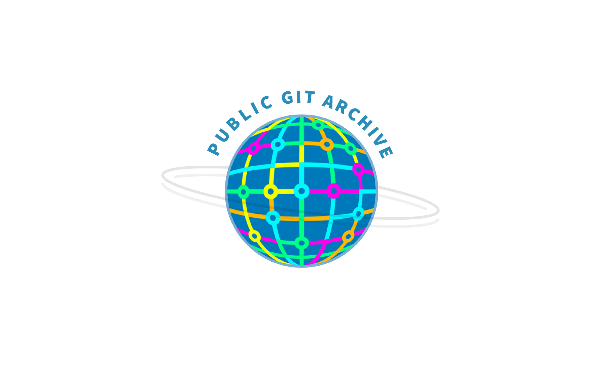

# PGA Artwork

### Public Git Archive Dataset

The dataset contains 3TB of repositories from GitHub ready to download. This includes all of the contents (git metadata and file contents) for all of the repositories on GitHub with 50 or more stars. The list of repositories was obtained from the [GHTorrent project](http://ghtorrent.org/), specifically from the snapshot of January 1st 2018. GHTorrent provides information about GitHub repositories but unfortunately doesn’t include the file contents.

You can download it from the releases page at [github.com/src-d/datasets](github.com/src-d/datasets).

#### PGA Art

- [High Definition Logo](pga/files/high-definition-pga.png) 127 KB
- [High Definition Logo transparent background](pga/files/high-definition-transparent-pga.png) 125 KB
- [High Definition Logo](pga/files/low-definition-pga.png) 120 KB
- [Low Definition Logo transparent background](pga/files/low-definition-transparent-pga.png) 119 KB
- [Original Illustrator File](pga/files/pga-logo-vector.ai) 701 KB